

    

### This repository aims to help code beginners with their first successful pull request and open source contribution. :partying_face:

## What is Hacktoberfest? :thinking:
A month-long celebration from October 1st to October 31st presented by [Digital Ocean](https://hacktoberfest.digitalocean.com/) and [DEV Community](https://dev.to/) collaborated with [GitHub](https://github.com/blog/2433-celebrate-open-source-this-october-with-hacktoberfest) to get people involved in [Open Source](https://github.com/open-source).

[https://hacktoberfest.digitalocean.com/](https://hacktoberfest.digitalocean.com/)

    

<h1 align="center">Seeking Roots</h1>

<h2  align="center" id="description"><strong>Seeking Roots</strong> is a web-application where users can register themselves providing their basic details and write posts or stories about themselves (AutoBiographies) and also about their near and dear ones (Biographies).</h2>

<h2>Features</h2>

Here're some of the project's major features:

*   Add user accounts (SignUp/SignIn).
*   Update User details.
*   Unique User Profile picture generated by API calls.
*   Add posts about themselves or somebody they know.
*   Upload multiimedia files and store it securely in the cloud(FireBase Storage).
*   Generate a downloadable PDF file for the article written.

## For more details, check out all the planned features, completed targets and the pending targets [here](https://github.com/users/SSHSRN/projects/2/views/1)!
## Check out the deployed website [here](https://sshsrn.github.io/Seeking-Roots)
## Check out the Issues created for this project [here](https://github.com/SSHSRN/DevJams-2022__Seeking-Roots/issues)
## Check out the Pull Requests created for this project [here](https://github.com/SSHSRN/DevJams-2022__Seeking-Roots/pulls?q=is%3Apr+is%3Aclosed)

<h2>Built with</h2>

**Front-End:** 
* HTML5
* CSS3
* JavaScript

**Back-End**
* FireBase

## Deployed to

- <h2>Front-end : GitHub pages </h2>

- <h2>Back-end : Firebase functions are already cloud hosted </h2>

<h2>Like our work and would like to support us? Or have an idea that can be implemented in this project?</h2>

Contact us at: sshsrn@gmail.com sm2482@srmist.edu.in

## Screenshots

* Front-end UI Screenshots:
    * SignUp page   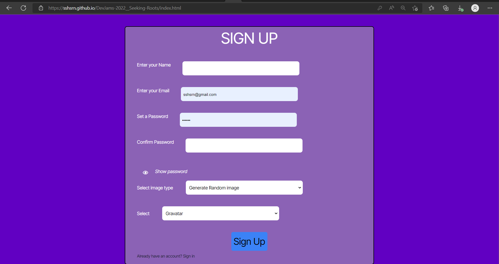
    * LogIn page   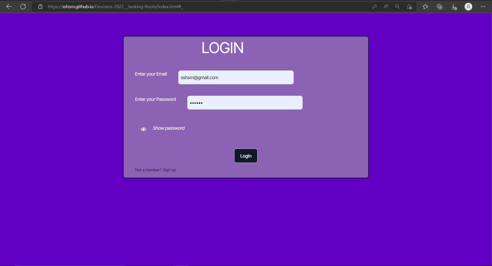
    * User Profile page loading animation   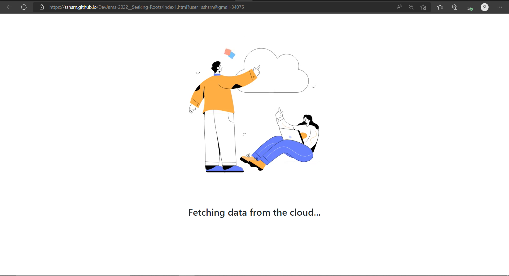
    * User Profile page   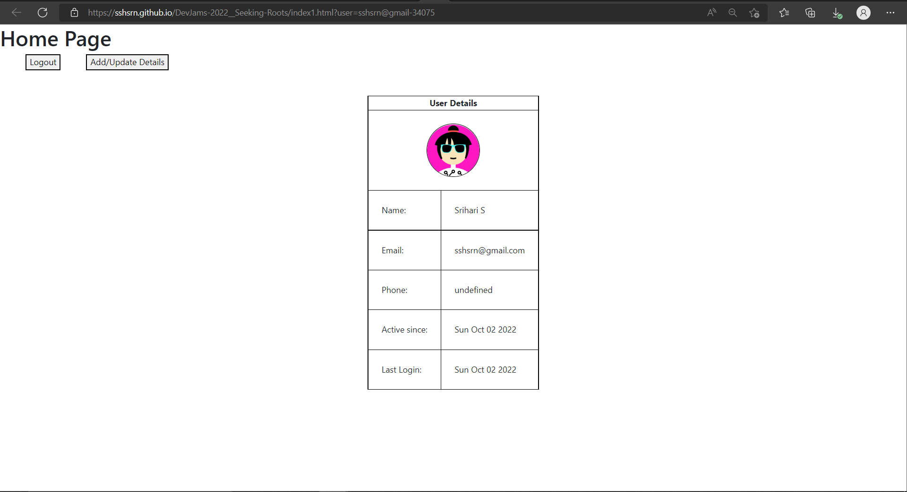
    * User Profile page (Update Details)   
    * Biography page(Add stories of people as a text or upload multimedia files)   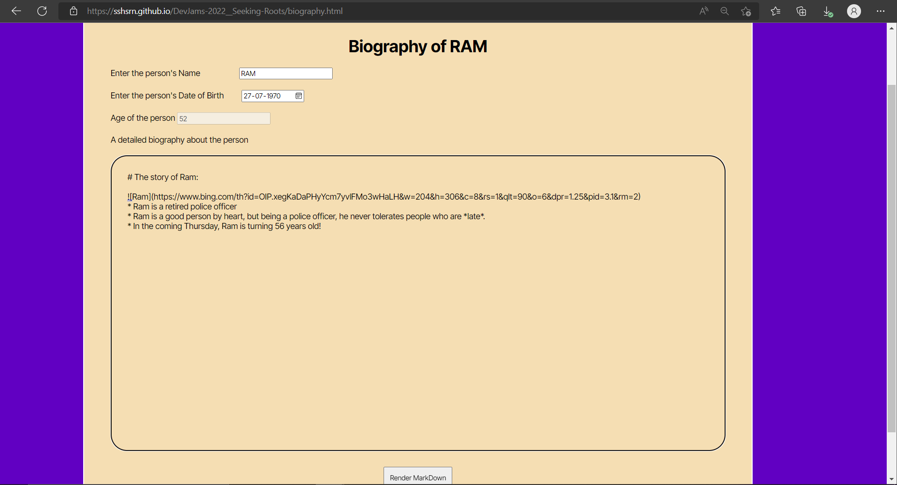
    * Rendered MarkDown in Biography page   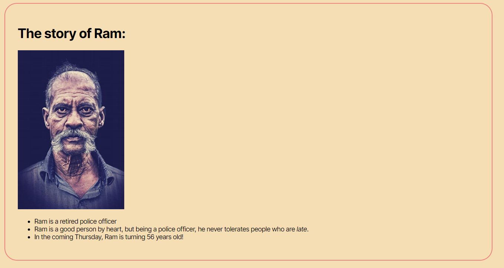
    * Save the article as PDF   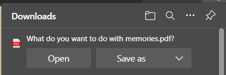
    * Uploading multimedia   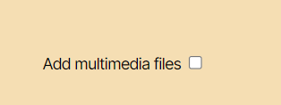
    * Select multimedia files to upload   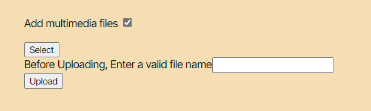
    * Preview of the image selected to upload   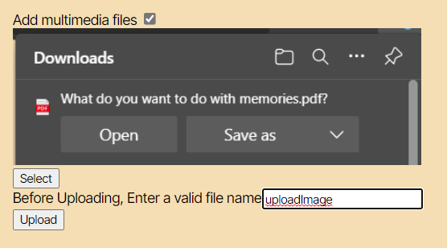
* Back-end Screenshots (from **FireBase**):
    * FireBase RealTime DataBase(RTDB) showing all users   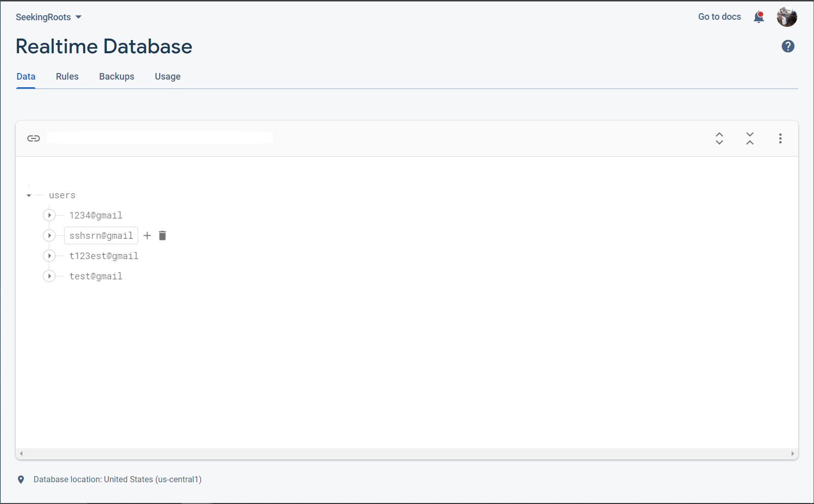
    * FireBase Storage showing all users who have uploaded multimedia files in their account   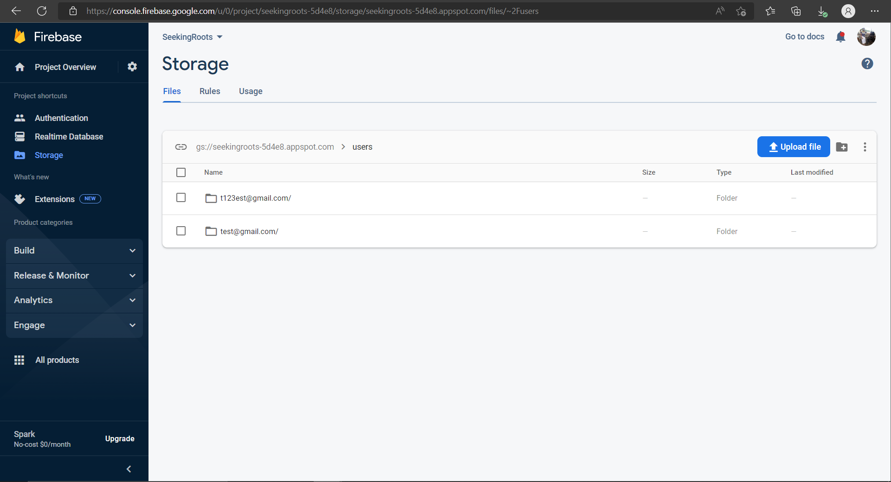
    * FireBase Storage showing multimedia by a specific user   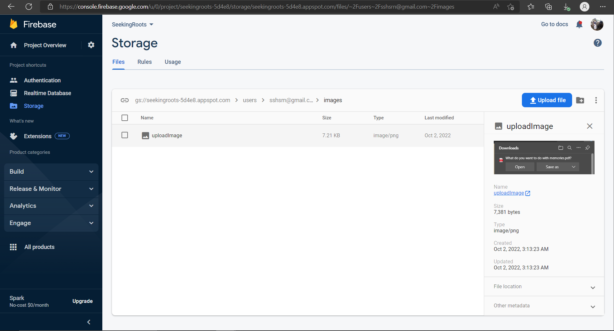
    * FireBase Authentication showing all users   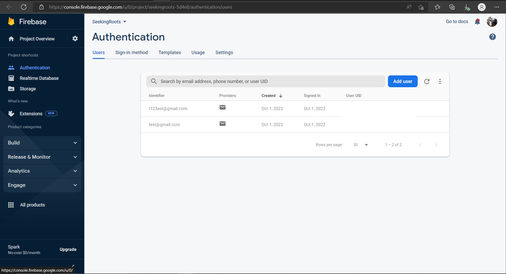
